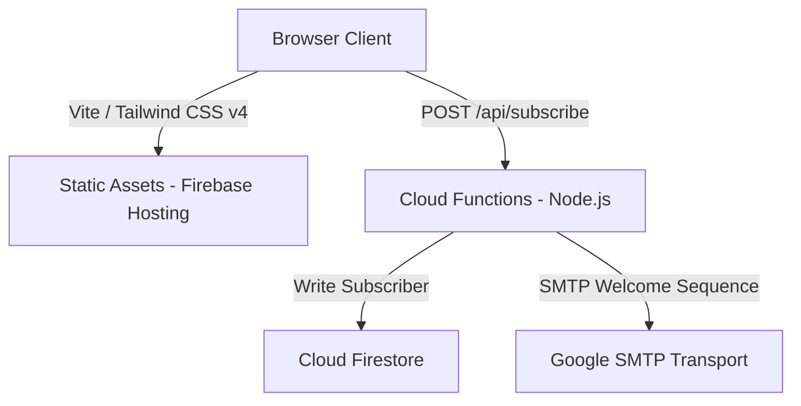

# Osmos Website

This repository contains the marketing landing page and waitlist portal for **[Osmos](https://useosmos.com)**, a local-first version control system for designers, writers, and teams. 

The site is built with a premium, responsive glassmorphism UI, a native-feeling dark mode toggle, and a robust waitlist system powered by Firebase Hosting, Cloud Functions, and Firestore.

---

## Architecture Overview

The project is divided into two main layers: a high-performance frontend static application and a serverless backend for GDPR-compliant subscription handling.



### 1. Frontend Client
- **Vite & Tailwind CSS v4**: Built as a super-fast single page application utilizing PostCSS and Tailwind's native Vite plugin.
- **Theme Manager**: Custom local storage-persistent light/dark mode configuration, featuring smooth CSS transitions.
- **Waitlist Form**: An interactive, animated email submission form that handles consent, client-side validation, and seamlessly morphs into a success view upon API confirmation.

### 2. Serverless Backend
- **Firebase Hosting Rewrites**: Directs `/api/subscribe` traffic to the `subscribe` cloud function.
- **Cloud Functions (`functions/index.js`)**:
  - Validates client-side payloads and email integrity.
  - Performs GDPR/KVKK-compliant IP hashing and anonymization.
  - Restricts double-opt-ins and tracks submission timestamps in Firestore.
  - Automatically sends a multi-email welcome sequence using Gmail SMTP pooled connections.
- **Cloud Firestore**: Stores subscriber state, source, and subscription timestamp securely.

---

## Directory Layout

```text
├── src/
│   ├── globals.css         # Styling system & Tailwind CSS setup
│   └── main.js             # Client interactivity (Dark mode, waitlist form, animation)
├── functions/
│   ├── index.js            # Node.js Firebase Cloud Function (subscription, mail SMTP)
│   ├── package.json        # Backend dependencies (nodemailer, firebase-admin)
│   └── package-lock.json   # Backend locked dependency tree
├── public/                 # Static landing page media and vector assets
├── index.html              # Core HTML structure
├── vite.config.js          # Vite compilation config
├── firebase.json           # Firebase Hosting, Rewrites, Headers, and Emulator mapping
├── firestore.rules         # Security rules protecting Firestore collection write/reads
├── test_osmos.py           # Playwright E2E Python test suite for core UI features
└── package.json            # Frontend dependency definitions and scripts
```

---

## Getting Started

### Prerequisites

- Node.js (v22+)
- Firebase CLI (for emulator testing and manual deployment)
- Python (with `playwright` package installed if running integration tests)

### Local Development

1. Install local dependencies:
   ```bash
   npm install
   ```

2. Start the Vite development server:
   ```bash
   npm run dev
   ```
   The site will be running at `http://localhost:5173`.

### Firebase Emulators (Local Backend Testing)

To test Firestore writes, Cloud Functions execution, and custom headers locally:

1. Initialize the Firebase Emulator:
   ```bash
   npx firebase-tools emulators:start
   ```

2. Access the Emulator Suite at `http://localhost:4000` and the mock frontend endpoint at `http://localhost:5002`.

### End-to-End Testing

The project has a built-in E2E regression test suite verifying Dark Mode toggling and waitlist success flow using Playwright:

```bash
# Setup Python playwright dependencies
pip install playwright
playwright install

# Run the test suite (requires local Vite server running)
python test_osmos.py
```

---

## Waitlist API Reference

### POST `/api/subscribe`

Registers a new user to the Osmos waitlist and queues the welcome email sequence.

#### Request Payload
```json
{
  "email": "developer@useosmos.com",
  "consent": true
}
```

#### Response (Success - 200 OK)
```json
{
  "success": true,
  "message": "Subscribed successfully"
}
```

#### Response (Validation Error - 400 Bad Request)
```json
{
  "error": {
    "code": "INVALID_EMAIL",
    "message": "Please enter a valid email address."
  }
}
```

---

## CI/CD & Deployment

Deployments are fully automated via GitHub Actions:

| GitHub Event | Action Triggered | Target |
| --- | --- | --- |
| Pull Request | `firebase-hosting-pull-request.yml` | Deploys a temporary preview channel for review |
| Push/Merge to `main` | `firebase-hosting-merge.yml` | Deploys to live production at `useosmos.com` |

To deploy hosting manually:
```bash
npx firebase-tools deploy --only hosting
```

---

## License

This project is licensed under the MIT License. See [LICENSE](LICENSE) for details.
