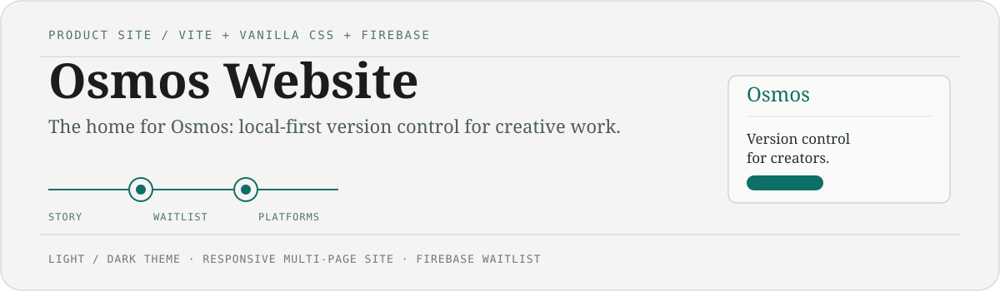

<p align="center">
  
</p>

<p align="center">
  <a href="https://useosmos.com"><b>useosmos.com</b></a>
  &nbsp;·&nbsp;
  <a href="https://github.com/Osmos-App/osmos-core">Core engine</a>
  &nbsp;·&nbsp;
  <a href="https://github.com/Osmos-App/osmos-ts">Desktop app</a>
  &nbsp;·&nbsp;
  <a href="README.tr.md">🇹🇷 Türkçe</a>
</p>

---

This repository is the **product website and waitlist** for [Osmos](https://useosmos.com) — a local-first version-control system for people who create with files: designers, writers, editors, and developers. Most creative work starts as a folder, not a Git repository, and Osmos keeps a private, easy-to-return-to history right beside it.

The site is a responsive, multi-page [Vite](https://vitejs.dev) build with an editorial **paper-and-teal** design system, light and dark themes, and a Firebase-backed waitlist.

## What’s on the site

| Section | Purpose |
| --- | --- |
| Home | The Osmos product story and the local-first approach |
| Platforms | macOS, Windows, Linux, and Android pages |
| Features · Security · Pricing | How Osmos works and what it protects |
| Open source · Docs · Blog | Project background and writing |
| Download · Waitlist | The path to first use |

## Stack

| Layer | Tooling |
| --- | --- |
| Build | Vite |
| Styling | Vanilla CSS with Tailwind CSS v4 utilities and custom design tokens (`src/globals.css`) |
| Hosting & data | Firebase Hosting and Firestore |
| Browser checks | Python + Playwright (`test_osmos.py`) |

## Run locally

```bash
npm install
npm run dev
```

Vite serves the site at `http://localhost:5173`. Build for production with:

```bash
npm run build
```

### Firebase emulators

To exercise hosting and the waitlist against local Firebase services:

```bash
npx firebase-tools emulators:start
```

The Emulator Suite opens at `http://localhost:4000`.

## Project map

```text
src/globals.css   typography, color tokens, and the responsive paper-and-teal system
src/main.js       client interactions and waitlist behavior
public/           static files, robots.txt, sitemap.xml
*/index.html      product, platform, and information pages
firebase.json     hosting, headers, and emulator configuration
firestore.rules   waitlist data access rules
```

## Related repositories

- [`osmos-core`](https://github.com/Osmos-App/osmos-core) — the Rust engine: content-addressable local history, SQLite metadata, and a daemon API.
- [`osmos-ts`](https://github.com/Osmos-App/osmos-ts) — the Tauri + React desktop client.

## License

MIT — see [LICENSE](LICENSE).
